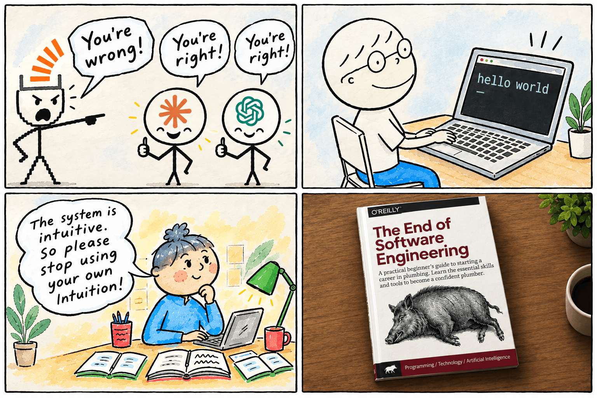

### Moien 👋
I'm [Osmar](https://osmarpetry.dev) — Luxembourgish-Brazilian, based in Luxembourg,
building and operating resilient AI products in TypeScript and Python.

**Operating** is the part that is not on the [resume](https://osmarpetry.dev/resume/): I go
as deep as the product needs. Temporal workflows that survive retries and partial failures,
Postgres and Supabase schemas and queries, tracing and structured logs so a bad run is
diagnosed from evidence instead of guessed at. Not a DBA, not an SRE — the slice of each
that keeps my own products up.

I speak **Portuguese** and **English**, I'm learning **French**. Ask me anything in the first two; be
patient with the third.

My CV also lives in DNS, if you have a terminal:

```bash
printf '%b\n' "$(dig +short TXT cv.osmarpetry.dev | sed 's/" "//g; s/^"//; s/"$//; s/\\\\/\\/g')"
```

#### 🛠️ Repositories I created recently
- **[osmarpetry/.github](https://github.com/osmarpetry/.github)** - Workflows compartilhados: CI + automerge do Dependabot
- **[osmarpetry/dns-cv](https://github.com/osmarpetry/dns-cv)** - An interactive CV published as DNS TXT records: dig +short TXT cv.osmarpetry.dev
- **[osmarpetry/dotfiles](https://github.com/osmarpetry/dotfiles)** - moving my dotfiles to a reusuble dotfiles wip
- **[osmarpetry/echo-coach-lingue](https://github.com/osmarpetry/echo-coach-lingue)** - Language typing trainer with custom Markdown practice, TTS listening, speed benchmarking, and pronunciation context links.
- **[osmarpetry/portifolio-eleventry](https://github.com/osmarpetry/portifolio-eleventry)** - The eleventry resume.

#### ⛏️ What I've been working on

- [osmarpetry/dotfiles](https://github.com/osmarpetry/dotfiles)
- [osmarpetry/weather-7](https://github.com/osmarpetry/weather-7)
- [katesclau/slacker](https://github.com/katesclau/slacker)

#### 📚 Books I'm reading
- **[The Pragmatic Programmer: From Journeyman to Master](https://www.goodreads.com/review/show/4304546327?utm_medium=api&utm_source=rss)**
- **[The Staff Engineer's Path: A Guide for Individual Contributors Navigating Growth and Change](https://www.goodreads.com/review/show/8930129669?utm_medium=api&utm_source=rss)**
- **[The Art of Doing Science and Engineering: Learning to Learn](https://www.goodreads.com/review/show/8930128825?utm_medium=api&utm_source=rss)**

More on my [Goodreads](https://www.goodreads.com/user/show/117658013-osmarpetry).

#### 📄 Latest blog posts
- [JavaScript Modules and Bundlers](https://osmarpetry.dev/blog/javascript-modules-and-bundlers/) (5 months ago)
- [PixieShop Authentication Playbook — OIDC SSO Across Four Identity Providers](https://osmarpetry.dev/blog/sso-authentication-playbook/) (6 months ago)
- [Backend Architectures — history, case studies & dogfooding](https://osmarpetry.dev/blog/introduction-to-be-archtitectures/) (1 year ago)

#### 🔕 Where I am not

I don't do social media. The noise costs more than the signal — it's like having your best
friends hang out in a bar full of alcoholics and smokers. I read the web through Inoreader
over RSS, and when a site insists, an anonymous account. YouTube is the worst offender of
the lot, but with Untrap I get to pretend I'm in control.

People I've worked with left **[recommendations on LinkedIn](https://www.linkedin.com/in/osmarpetry/details/recommendations/)** — I try to keep at least one per role.

#### 🐖 And finally

They keep telling me software engineering is over. I keep shipping anyway.



<!--
  Everything above this line is generated daily by readme-scribe.
  Edit templates/readme.md.tpl, never README.md — your edits there get overwritten.
-->
